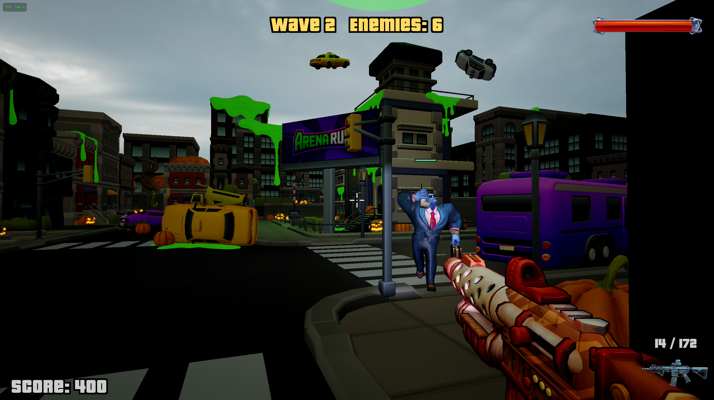
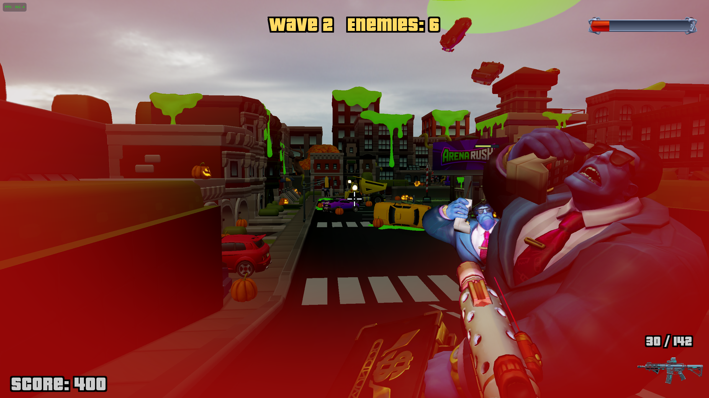
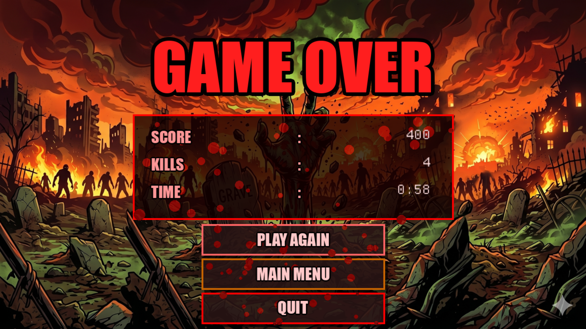
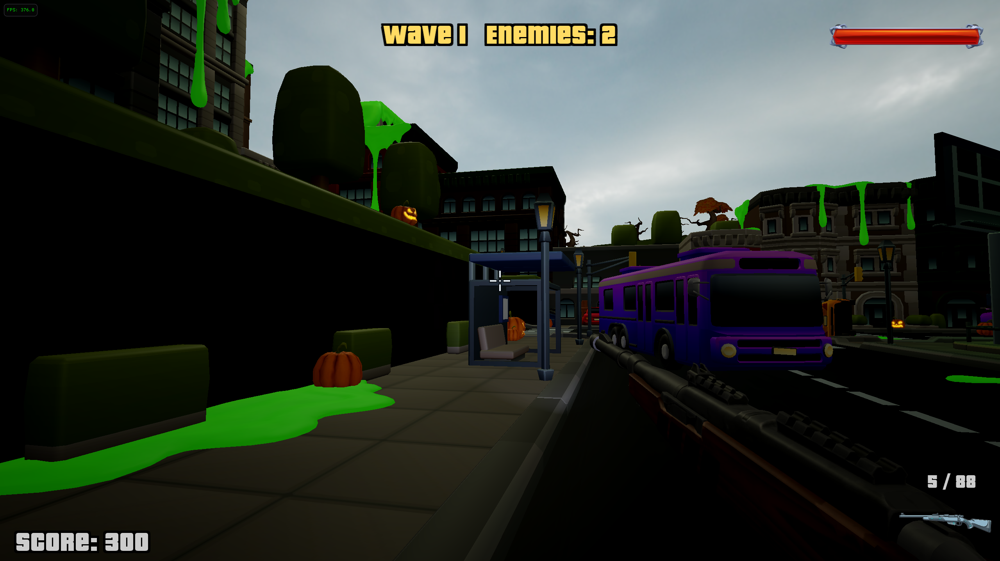
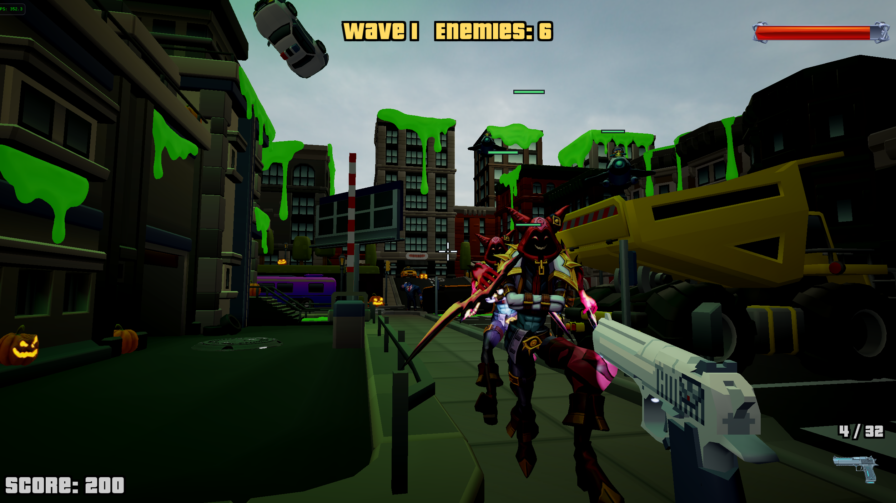

# Arena Rush

Arena Rush is a first-person 3D arena shooter built from scratch using C++ and OpenGL, following an Entity-Component-System (ECS) architecture. The player is dropped into a closed urban arena and must survive increasingly difficult waves of enemies while managing limited health and ammunition.

## Features

### Enemies

The game features three distinct enemy archetypes:

- **Brute (Monster)**: A slow, heavily-armoured melee enemy that deals devastating close-range damage.
- **Charger**: A fast, aggressive melee enemy that rushes the player at high speed.
- **Drone (Flyer)**: A ranged flying enemy that orbits the player and fires projectiles from a distance.

### Arsenal

The player has access to three switchable weapons:

- **Automatic Rifle (AR)**: Fully automatic, high rate of fire, moderate damage.
- **Hunting Rifle**: Semi-automatic, very high damage per shot, slow fire rate.
- **Deagle**: Semi-automatic pistol, balanced damage and fire rate.

### Technical Highlights

- **Graphics & Rendering**: PBR and Blinn Phong shading, Bloom post-processing, HDR tone-mapping, and a blood-splatter screen effect. Full model loading with multiple meshes, materials, and textures.
- **Animation**: Skeletal animation for all enemy and map models (GLTF).
- **Physics**: Bullet-physics-based collision with capsule colliders and GImpact & BVH Triangles mesh colliders.
- **Artificial Intelligence**: Context-steering AI for ground enemies and orbital AI for flyers.
- **Gameplay Systems**: A data-driven, JSONC-configured wave progression system with 10 escalating waves.
- **Audio**: Spatial audio via OpenAL (ambient, weapon fire, enemy attacks, reload).
- **User Interface**: Menu system (Main, Pause, GameOver) with HUD elements including health bar, ammo counter, weapon icon, wave countdown, crosshair, and enemy health bars.
- **Movement Mechanics**: Sprinting, crouching, sliding, dashing, and jumping with full collision response.

## Screenshots

<table>
	<tr>
		<td align="center"><br><sub>Main Menu</sub></td>
		<td align="center"><br><sub>Gameplay</sub></td>
		<td align="center"><br><sub>Enemy Encounter</sub></td>
	</tr>
	<tr>
		<td align="center"><br><sub>Game Over</sub></td>
		<td align="center"><br><sub>Different weapon</sub></td>
		<td align="center"><br><sub>Different enemy</sub></td>
	</tr>
</table>

## Getting Started

This project uses `CMake` and `just` (a command runner) for its build system, with optional support for `Nix`.

### Build Commands (using `just`)

- **`just dev`**: Enter the Nix development environment (if using Nix).
- **`just build`**: Configure and build the project using CMake and Ninja.
- **`just run`**: Run the game using a dedicated Nvidia/AMD GPU.
- **`just run-int`**: Run the game on the integrated GPU.
- **`just clean`**: Remove the `build` and `bin` directories.
- **`just package`**: Package the project using Nix.
- **`just desktop`**: Create a desktop entry for the game.

Alternatively, you can manually build using CMake:

```sh
cmake -S . -B build -G Ninja -DCMAKE_BUILD_TYPE=Debug
cmake --build build
./bin/ArenaRush
```
